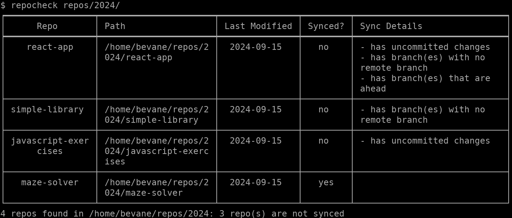

# Repo Check

Repo Check is a CLI tool that lists out all local git repos in a directory along with
additional information such as the last modified date of the repo, whether the
repo is synced with remote etc.

## Installation

Install go v1.22 or later - [Official installation instructions](https://go.dev/doc/install)

To download and install repocheck, run:

`go install github.com/bevane/repocheck@latest`

## Usage

### Basic Usage

Command help

`repocheck -h` or `repocheck --help`

Running repocheck without any args will list the repos in current directory

`repocheck`

Target directory can be passed in as an arg either as a relative path or an absolute path

`repocheck projects`

`repocheck /home/user/projects`

### Additional flags

#### Sort
Sort flag `-s` or `--sort` can be used to sort the results by a specific key

`repocheck --sort=name` to sort by repo name

`repocheck -s=synced` to sort by sync status of the repo - unsynced repos will be at the top

#### Filter
Filter flag `-F` or `--filter` can be used to filter the results by either
sync status or last modified date

`repocheck --filter synced=yes` to only show repos that are synced

`repocheck -F lastmodified=2024-01-01` to only show repos that were last modified on 2024-01-01

`repocheck -F "lastmodified>=2024-01-01"` to only show repos that were last modified on or later than 2024-01-01

*Note: for options containing '<' or '>' surround the entire filter option with quotes to prevent them from being interpreted as operators by bash*

# Planned features
- [ ] Add flag for plain output to only output the absolute paths of the repos
- [ ] Add flag for json output
- [ ] Add head and tail flag to limit output

# Discussions

Interested in this project and have requests for specific features or want to discuss about this repo?
Let me know in [discussions](https://github.com/bevane/repocheck/discussions)

# License
Repo Check is released under the MIT License
